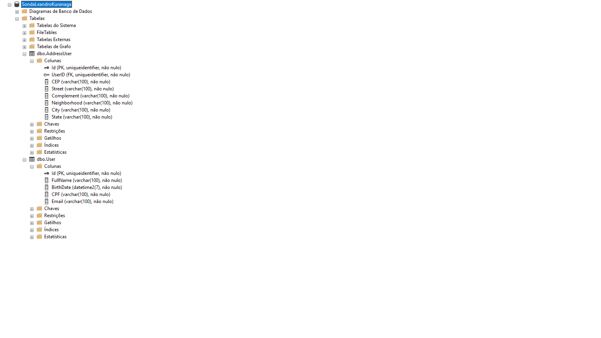

# Aplicação

Veja o vídeo abaixo.

## Ferramentas, Banco de dados
 ___   
Para o uso e teste da aplicação favor utilizar o comando **git clone https://github.com/lekuranaga/HiringSonda.git**

O ambiente utilizado para desenvolver a aplicação foi o **Windows 11.**

Para o desenvolvimento foi utilizado o **SQL Server Express 2019** como banco de dados e o projeto foi desenvolvido utilizando o **Visual Studio 2022** a base criada é a **SondaLeandroKuranaga** e é configurável através do arquivo **appsettings.json**.

## Projeto
___

O projeto foi dividido em camadas, sendo utilizado a **onion architecture**, além de utilizar **Entity Framework Core (Design, Relational, SqlServer, Tools)** juntamente com a migration **add-migration SondaHiring**.

A Estrutura do banco de dados na imagem abaixo.

A camada de aplicação **(HiringSonda)** é onde estão os controllers e as views.

A camada de **domínio (HiringSonda.Domain)** é onde fica a regra de negócio, possui as interfaces e os models.

A camada de **infra (HiringSonda.Infra)** é onde fica a parte de conexão com banco de dados, mapeamentos, migrations, repositórios, dbcontext.

### Dependências
___

* A camada de **infra (HiringSonda.Infra)** possui a dependência do projeto **domínio (HiringSonda.Domain)**.

* A camada de Aplicação **(HiringSonda)** possui a dependência dos projetos **domínio (HiringSonda.Domain)** e **infra (HiringSonda.Infra)**.
