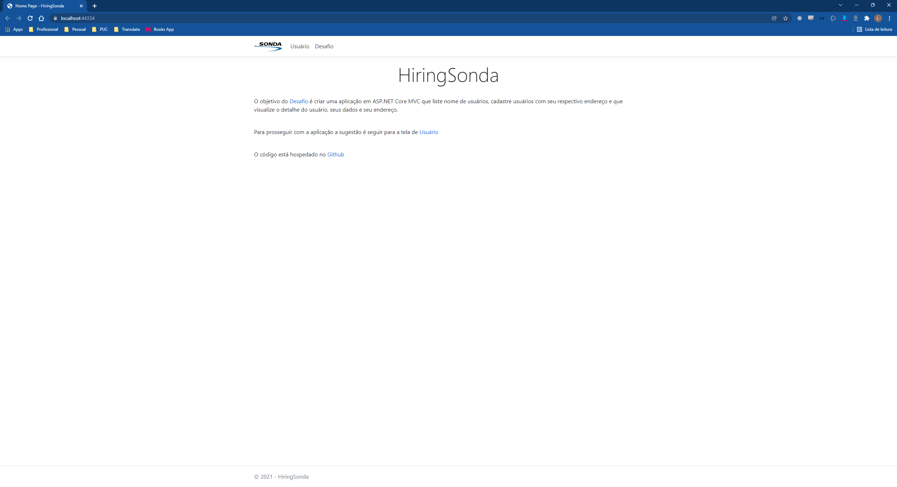

# HiringSonda


---

## 🎬 Application

See the video below:

[](https://www.youtube.com/watch?v=pjoMfjlkklA)

---

## 🛠️ Tools & Database

To use and test the application, run the following:

```bash
git clone https://github.com/lekuranaga/HiringSonda.git
```

* Developed on **Windows 11**.
* Database: **SQL Server Express 2019**
* IDE: **Visual Studio 2022**
* Database name: `SondaLeandroKuranaga` (configurable in `appsettings.json`)

---

## 🧱 Project Architecture

The project uses **Onion Architecture**, with the following structure:

* ✅ **HiringSonda**: Controllers and Views (Presentation Layer)
* 🧠 **HiringSonda.Domain**: Business rules, Interfaces, and Models (Domain Layer)
* 💾 **HiringSonda.Infra**: DB Context, Mappings, Migrations, Repositories (Infrastructure Layer)

Entity Framework Core packages used:

* `Design`
* `Relational`
* `SqlServer`
* `Tools`

Migration created using:

```bash
add-migration SondaHiring
```

Database diagram:


Connection string example:

```
(localdb)\MSSQLLocalDB
```

Authentication: Windows Auth (compatible with SQL Server 2017 and 2019)

---

## 🔗 Dependencies

* `HiringSonda.Infra` depends on `HiringSonda.Domain`
* `HiringSonda` (application layer) depends on both `HiringSonda.Domain` and `HiringSonda.Infra`

---

## 📜 License

This project is licensed under the MIT License.
